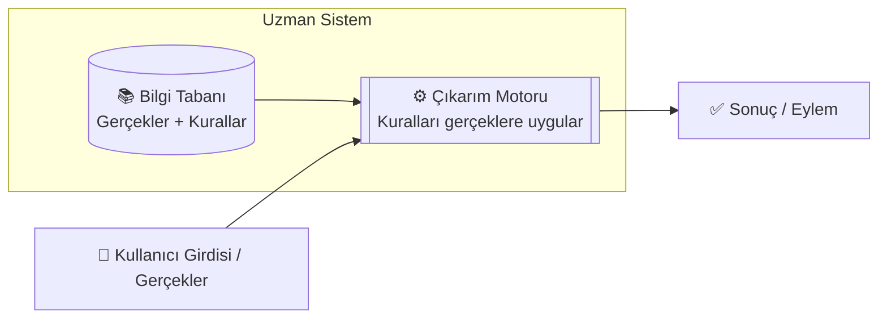
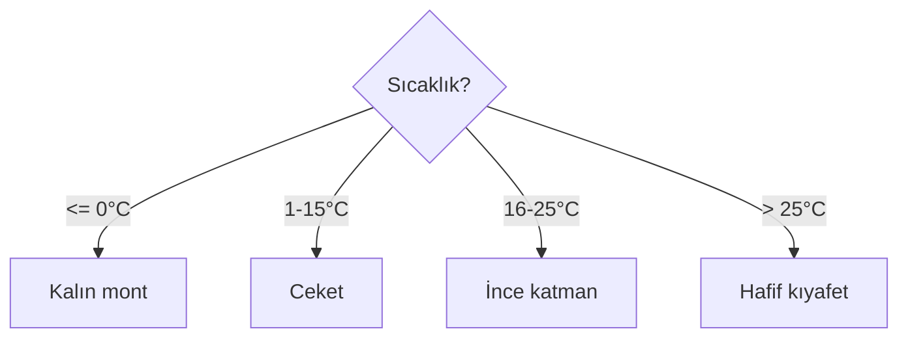
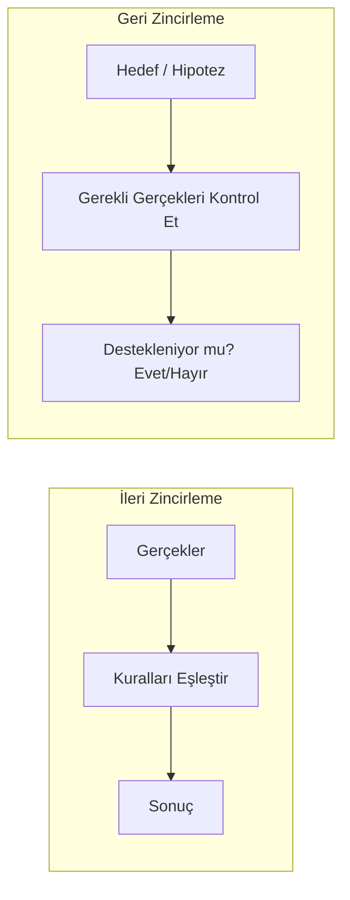

# Bölüm 01 — Kural Tabanlı Yapay Zeka 🧩

[⬅ Yol Haritasına Dön](../README.md) | [➡ Sonraki: Makine Öğrenmesi](../02-Machine-Learning/README.md)

---

| 🎯 Zorluk | ⏱️ Tahmini Süre | 📋 Ön Koşullar | 🏆 Kazanımlar |
|---|---|---|---|
| Başlangıç | 4–6 saat | Temel Python (değişkenler, fonksiyonlar, döngüler) | EĞER-O HALDE mantığı, uzman sistemler, ileri/geri zincirleme, 10 çalışan proje |


## 📖 Giriş

Makineler "öğrenebilmeden" önce bile, bir insan onlara her durumda tam olarak ne yapmaları gerektiğini söylediği sürece akıllıca davranabiliyorlardı. İşte bu **Kural Tabanlı Yapay Zeka**: yapay zekanın en eski ve en şeffaf biçimi, ve bu kursun geri kalanının üzerine inşa edildiği temel.

Bu bölümün sonunda, kural tabanlı sistemlerin sadece *ne* olduğunu değil, *neden* sonunda bir duvara çarptığını da anlayacaksınız — bu da tam olarak Bölüm 2'deki Makine Öğrenmesi'nin motivasyonudur.

---

## 🎯 Öğrenme Hedefleri

Bu bölümün sonunda şunları yapabileceksiniz:

- [ ] Kural Tabanlı Yapay Zeka'nın ne olduğunu ve Makine Öğrenmesi'nden nasıl farklılaştığını açıklamak
- [ ] Uzman Sistemlerin tarihini ve gerçek dünya etkisini tanımlamak
- [ ] EĞER-O HALDE (IF-THEN) mantığını, Bilgi Tabanlarını ve Çıkarım Motorlarını açıklamak
- [ ] İleri zincirleme ile geri zincirlemeyi ayırt etmek
- [ ] Kural tabanlı yaklaşımların avantajlarını ve dezavantajlarını belirlemek
- [ ] 10 çalışan kural tabanlı Python programı inşa etmek
- [ ] Kural tabanlı mantığın modern yazılımlarda hâlâ nerede kullanıldığını tanımak

---

## 🕰️ Tarihsel Arka Plan

| Dönem | Kilometre Taşı |
|-------|------------------|
| 1950'ler | Erken sembolik yapay zeka araştırmaları başlar (Newell & Simon'un *Logic Theorist*'i) |
| 1965 | **DENDRAL** — ilk uzman sistem, kimyasal bileşikleri analiz etti |
| 1966 | **ELIZA** — bir psikoterapisti simüle eden desen eşleştirmeli sohbet botu |
| 1972 | **MYCIN** (Stanford) — bakteriyel enfeksiyonları teşhis etti, antibiyotik önerdi; dönemin insan uzmanlarıyla yarışan ~%65-70 doğruluk oranına sahipti |
| 1980'ler | "Uzman Sistemler patlaması" — işletmeler finans, üretim, teşhis alanlarında kural motorlarını benimser |
| 1980'lerin sonu | **"Yapay Zeka Kışı"** — kural sistemlerinin ölçeklendikçe çok kırılgan ve bakımı pahalı olduğu ortaya çıkar, finansman çöker |
| Günümüz | Kural motorları daha büyük sistemlerin *bileşenleri* olarak hayatta kalıyor (dolandırıcılık tespiti tetikleyicileri, uyumluluk kontrolleri, iş mantığı) — artık "yapay zeka" olarak pazarlanmıyor ama hâlâ temel |

> 💡 **İpucu:** 1980'lerdeki Uzman Sistemler patlamasının *neden* sonunda durduğunu anlamak, Makine Öğrenmesi'nin (Bölüm 2) neden gerekli hale geldiğini anlamak için en iyi motivasyondur.

---

## 🧠 Temel Teori

### Kural Tabanlı Yapay Zeka Nedir?

Kural Tabanlı Yapay Zeka, verilerden otomatik olarak öğrenilen desenler yerine, bir insan uzman tarafından yazılmış **açık EĞER-O HALDE (IF-THEN) kuralları** kullanarak karar veren herhangi bir sistemdir.

```
EĞER <koşul>
O HALDE <eylem / sonuç>
```

Fikrin tamamı bu kadar. Bu bölümdeki her şey bu tek desenin bir varyasyonudur.

### Uzman Sistemler

**Uzman Sistem**, dar bir alanda (tıp, hukuk, mühendislik) bir insan uzmanın karar verme sürecini taklit etmek için tasarlanmış kural tabanlı bir programdır. Her uzman sistemin iki temel parçası vardır:



- **Bilgi Tabanı** — bir alan uzmanının bilgisini kodlayan saklanmış gerçekler ve EĞER-O HALDE kuralları.
- **Çıkarım Motoru** — mevcut gerçekleri kurallarla eşleştiren ve hangi kuralların "tetikleneceğine" karar veren akıl yürütme bileşeni.

### EĞER-O HALDE Mantığı ve Karar Ağaçları

Kural tabanlı akıl yürütmenin en basit birimi:

```python
if temperature <= 0:
    advice = "Kalın bir mont giyin."
```

Bunlardan yeterince çoğunu farklı koşullara dallanacak şekilde zincirlerseniz, bir **karar ağacı** elde edersiniz — önemli olan burada *kural tabanlı* bir karar ağacı olması, yani her dalı bir insanın tasarlamış olmasıdır (Bölüm 2'nin *öğrenilmiş* karar ağaçlarının aksine; orada dallar otomatik olarak verilerden keşfedilir).



### İleri Zincirleme ile Geri Zincirleme



| | İleri Zincirleme | Geri Zincirleme |
|---|---|---|
| Başlangıç noktası | Bilinen gerçekler | Bir hedef/hipotez |
| Yön | Veri → Sonuç | Hedef → Kanıt |
| Tipik kullanım alanı | İzleme/otomasyon sistemleri (örn. akıllı ev) | Teşhis sistemleri (örn. "bu X hastalığı olabilir mi?") |
| Bu bölümdeki örnek | Hava Durumu Asistanı (01) | Tıbbi Semptom Kontrolcüsü (04) |

### Kural Tabanlı Yapay Zeka'nın Avantajları

- ✅ **Tamamen açıklanabilir** — hangi kuralın tetiklendiğini her zaman izleyebilirsiniz
- ✅ **Eğitim verisi gerektirmez** — kurallar yazıldığında hemen çalışır
- ✅ **Deterministik** — aynı girdi her zaman aynı çıktıyı verir
- ✅ **Yasal/uyumluluk açısından kritik alanlar için denetlenmesi kolay**

### Kural Tabanlı Yapay Zeka'nın Dezavantajları

- ❌ **Ölçeklenmez** — binlerce kural yönetilemez hale gelir ve çakışmaya yatkındır ("kural patlaması")
- ❌ **Kırılgandır** — kural yazarının öngörmediği durumlara genelleme yapamaz
- ❌ **Bakımı pahalıdır** — her alan değişikliği bir insanın kuralları yeniden yazmasını gerektirir
- ❌ **Öğrenme yoktur** — sistem deneyimden veya yeni verilerden asla gelişmez

> ⚠️ **Uyarı:** Açıklanabilir-ama-kırılgan ile esnek-ama-belirsiz arasındaki bu gerilim, tüm yapay zeka alanının merkezi temasıdır ve önümüzdeki her bölümde tekrar karşınıza çıkacaktır.

### Gerçek Dünya Uygulamaları (Hâlâ Kullanımda)

| Alan | Örnek |
|------|-------|
| Finans | Dolandırıcılık tespiti tetikleyici kuralları, kredi uygunluk kontrolleri |
| Uyumluluk | Vergi hesaplama motorları, düzenleyici kontrol listeleri |
| Üretim | PLC tabanlı endüstriyel kontrol sistemleri |
| Siber Güvenlik | Güvenlik duvarı kuralları, spam kara listeleri |
| Müşteri Hizmetleri | IVR telefon menüleri, basit SSS botları |
| Otomotiv | Trafik ışığı kontrolcüleri, temel hız sabitleyici mantığı |

---


## 📁 Bu Bölümün Klasör Yapısı

```
01-Rule-Based-AI/
├── README.md          ← teori, diyagramlar, tam anlatım (bu dosya)
├── examples/            ← 10 çalıştırılabilir Python örneği
├── exercises/            ← alıştırmalar (exercises.md)
├── solutions/            ← alıştırma çözümleri (exercise_solutions.py)
├── quizzes/              ← quiz.md + quiz_answers.md
├── projects/             ← kapsamlı mini proje talimatları
├── notebooks/            ← etkileşimli Jupyter Notebook sürümü
├── datasets/              ← bu bölüm için örnek veri (gerekirse)
├── images/                ← diyagramlar için statik görseller
└── resources/             ← ek okuma listeleri, kopya kağıtları
```

## 💻 Python Örnekleri

Aşağıdaki her örnek, [`examples/`](examples/) klasöründe tam, çalıştırılabilir ve tamamen yorumlanmış bir programdır. Herhangi birini doğrudan çalıştırın:

```bash
cd 01-Rule-Based-AI/examples
python 01_weather_assistant.py
```

| # | Örnek | Dosya | Öne Çıkan Kavram |
|---|-------|-------|---------------------|
| 1 | Hava Durumu Asistanı | [`01_weather_assistant.py`](examples/01_weather_assistant.py) | İleri zincirleme, çoklu kural birleştirme |
| 2 | Giriş Sistemi | [`02_login_system.py`](examples/02_login_system.py) | Kurallar + durum (başarısız denemelerden sonra kilitleme) |
| 3 | Hesap Makinesi | [`03_calculator.py`](examples/03_calculator.py) | Kural dağıtım tabloları (fonksiyon sözlüğü) |
| 4 | Tıbbi Semptom Kontrolcüsü | [`04_medical_symptom_checker.py`](examples/04_medical_symptom_checker.py) | Geri zincirleme tarzı uzman sistem |
| 5 | Restoran Önerisi | [`05_restaurant_recommendation.py`](examples/05_restaurant_recommendation.py) | Ağırlıklı kural puanlaması |
| 6 | Öğrenci Notlandırma | [`06_student_grading.py`](examples/06_student_grading.py) | Kural tabanlı karar ağaçları |
| 7 | Trafik Işığı Kontrolcüsü | [`07_traffic_light_controller.py`](examples/07_traffic_light_controller.py) | Sonlu durum makineleri |
| 8 | ATM Menü Simülasyonu | [`08_atm_simulation.py`](examples/08_atm_simulation.py) | Değişken durumu güvenle yöneten kurallar |
| 9 | Akıllı Ev Otomasyonu | [`09_smart_home_automation.py`](examples/09_smart_home_automation.py) | Çoklu sensör kural değerlendirmesi, kural sıralaması |
| 10 | Kural Tabanlı Sohbet Botu | [`10_rule_based_chatbot.py`](examples/10_rule_based_chatbot.py) | Anahtar kelime desen eşleştirme (ELIZA tarzı) |

> 📌 Her dosya bir **"İyileştirme Fikirleri"** docstring'i ile biter — bunları aşağıdaki alıştırmalar için bir başlangıç noktası olarak kullanın.

---

## 🏋️ Alıştırmalar

İpuçlarıyla birlikte tam alıştırma seti: [`exercises/exercises.md`](exercises/exercises.md)

Yukarıdaki her örnek için birer rehberli görev içerir, ayrıca birden fazla örneği tek bir programda birleştiren bir **Mini Proje: "Kişisel Kural Tabanlı Asistan"** kapanış projesi de bulunur.

---

## 💡 Çözümler

Alıştırmaları kendiniz denedikten sonra [`solutions/exercise_solutions.py`](solutions/exercise_solutions.py) dosyasındaki referans çözümlerle karşılaştırın.

## 📓 Etkileşimli Notebook

Tüm örnekleri hücre hücre çalıştırmak isterseniz: [`notebooks/01_rule_based_ai.ipynb`](notebooks/01_rule_based_ai.ipynb)

## 🧪 Quiz

- Sorular: [`quizzes/quiz.md`](quizzes/quiz.md) (20 soru)
- Cevaplar: [`quizzes/quiz_answers.md`](quizzes/quiz_answers.md)

Bölüm 2'ye geçmeden önce 20 üzerinden en az 15 almaya çalışın — bir soru sizi zorlarsa, bu genellikle yukarıdaki belirli bir bölümü tekrar gözden geçirmeniz gerektiği anlamına gelir.

---

## 📌 Özet ve Önemli Çıkarımlar

- Kural Tabanlı Yapay Zeka = bir **Bilgi Tabanı**'na karşı bir **Çıkarım Motoru** tarafından uygulanan, insan tarafından yazılmış **EĞER-O HALDE kuralları**.
- **İleri zincirleme** gerçeklerden sonuçlara akıl yürütür; **geri zincirleme** bir hipotezden destekleyici kanıtlara geri akıl yürütür.
- MYCIN gibi Uzman Sistemler, kural tabanlı yapay zekanın *dar* alanlarda insan uzmanlarla eşleşebileceğini kanıtladı — ancak kural patlaması ve kırılganlık yaklaşımın ne kadar ölçeklenebileceğini sınırladı.
- Kural tabanlı mantık asla ortadan kalkmadı — modern yazılımların içinde doğrulama mantığı, iş kuralları ve güvenlik açısından kritik kontrol sistemleri olarak yaşamaya devam ediyor.
- Bu bölümün temel zayıflığı — **sistemin bir insanın açıkça yazdığının ötesinde öğrenememesi veya genelleyememesi** — tam olarak Makine Öğrenmesi'nin çözmek için icat edildiği sorundur.

---

## 📚 Önerilen Okumalar ve Kaynaklar

- Russell, S. & Norvig, P. — *Artificial Intelligence: A Modern Approach*, Bölüm 1–2 (Bilgi Tabanlı Ajanlar)
- Shortliffe, E. H. (1976). *Computer-Based Medical Consultations: MYCIN*
- Weizenbaum, J. (1966). *ELIZA — A Computer Program For the Study of Natural Language Communication*
- [Stanford Felsefe Ansiklopedisi — Uzman Sistemler](https://plato.stanford.edu/)
- Python `dataclasses` dokümantasyonu: https://docs.python.org/3/library/dataclasses.html

---

[⬅ Yol Haritasına Dön](../README.md) | [➡ Sonraki: Makine Öğrenmesi](../02-Machine-Learning/README.md)
