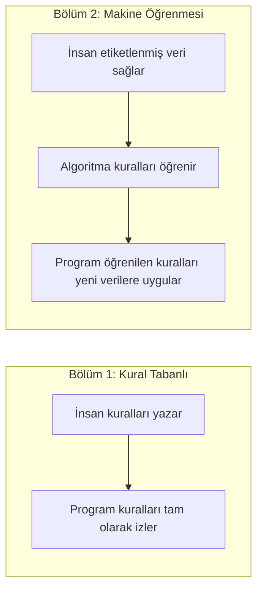
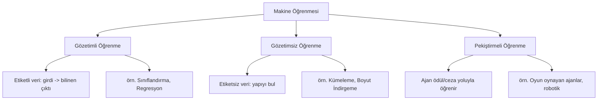
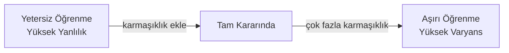
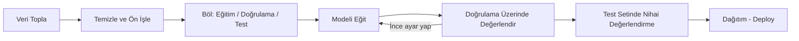

# Bölüm 02 — Makine Öğrenmesi 📈

[⬅ Önceki: Kural Tabanlı Yapay Zeka](../01-Rule-Based-AI/README.md) | [⬅ Yol Haritası](../README.md) | [➡ Sonraki: Derin Öğrenme](../03-Deep-Learning/README.md)

---

| 🎯 Zorluk | ⏱️ Tahmini Süre | 📋 Ön Koşullar | 🏆 Kazanımlar |
|---|---|---|---|
| Orta | 6–8 saat | Bölüm 1 + temel istatistik (ortalama, varyans) | Gözetimli/gözetimsiz öğrenme, model değerlendirme, 3 çalışan proje |


## 📖 Giriş

Bölüm 1, dünya el yazısı kurallarla tanımlanamayacak kadar karmaşık hale
geldiğinde kural tabanlı sistemlerin çöktüğünü gösterdi. Makine Öğrenmesi
bunu, bilgisayarın **kuralları kendisinin keşfetmesine**, doğrudan
verilerden, izin vererek çözer.

## 🎯 Öğrenme Hedefleri

- [ ] Kural Tabanlı Yapay Zeka'nın karmaşık, yüksek boyutlu problemler için neden yetersiz olduğunu açıklamak
- [ ] Gözetimli, Gözetimsiz ve Pekiştirmeli Öğrenmeyi ayırt etmek
- [ ] Tanımlamak: veri seti, özellikler, etiketler, eğitim, test, doğrulama
- [ ] Aşırı öğrenmeyi (overfitting), yetersiz öğrenmeyi (underfitting), yanlılığı (bias) ve varyansı açıklamak
- [ ] Tam bir ML iş akışı için NumPy, Pandas, Matplotlib ve Scikit-learn kullanmak
- [ ] Sınıflandırma, regresyon ve kümeleme modelleri eğitmek ve değerlendirmek

---

## 🧠 Temel Teori

### Kural Tabanlı Yapay Zeka Neden Yeterli Değil?

Spam e-postayı tespit etmek veya el yazısıyla yazılmış bir rakamı tanımak
için EĞER-O HALDE kuralları yazmaya çalıştığınızı düşünün. Uç durumların
sayısı fiilen sonsuzdur — hiçbir insan bunların hepsini kapsayacak kadar
kural yazamaz. Makine Öğrenmesi bunu, **binlerce etiketlenmiş örnekten
deseni öğrenerek** çözer.



### Üç Ana Öğrenme Türü



| Tür | Veri | Hedef | Örnek |
|------|------|------|---------|
| **Gözetimli** | Etiketli (X, y) | Yeni X için y tahmin et | Spam tespiti, ev fiyatı tahmini |
| **Gözetimsiz** | Etiketsiz (sadece X) | Yapıyı keşfet | Müşteri segmentasyonu |
| **Pekiştirmeli** | Ortam + ödül sinyali | Kümülatif ödülü maksimize et | Oyun yapay zekası, robot navigasyonu |

### Temel Kelime Dağarcığı

| Terim | Tanım |
|------|------------|
| **Veri Seti** | Model eğitmek/değerlendirmek için kullanılan tüm örnekler koleksiyonu |
| **Özellikler** | Her örneği tanımlayan girdi değişkenleri/sütunları (X) |
| **Etiketler** | Gözetimli öğrenme için bilinen doğru çıktı (y) |
| **Eğitim** | Model parametrelerini eğitim verisine uydurma süreci |
| **Test** | Gerçek dünya performansını tahmin etmek için nihai modeli görülmemiş veri üzerinde değerlendirme |
| **Doğrulama** | Geliştirme *sırasında* test setine dokunmadan ayarları ince ayar yapmak için kullanılan ayrı tutulmuş bir set |
| **Aşırı Öğrenme (Overfitting)** | Model eğitim verisi gürültüsünü ezberler; eğitimde iyi, yeni veride kötü performans gösterir |
| **Yetersiz Öğrenme (Underfitting)** | Model, temel deseni yakalamak için çok basittir; her yerde kötü performans gösterir |
| **Yanlılık (Bias)** | Aşırı basitleştirilmiş varsayımlardan kaynaklanan hata (yetersiz öğrenme ile ilişkilendirilir) |
| **Varyans (Variance)** | Eğitim verisi dalgalanmalarına aşırı duyarlılıktan kaynaklanan hata (aşırı öğrenme ile ilişkilendirilir) |



### Standart ML İş Akışı



### Değerlendirme Metrikleri

| Görev | Yaygın Metrikler |
|------|-----------------|
| Sınıflandırma | Doğruluk (Accuracy), Kesinlik (Precision), Duyarlılık (Recall), F1-skoru, Karışıklık Matrisi |
| Regresyon | Ortalama Kare Hata (MSE), Ortalama Mutlak Hata (MAE), R² |
| Kümeleme | Silüet Skoru, Atalet (küme içi mesafe) |

> ⚠️ **Uyarı:** Dengesiz veri setlerinde (örn. %99 "spam değil" örnekleri)
> sadece doğruluk yanıltıcı olabilir — her zaman kesinlik/duyarlılığı da
> kontrol edin.

---

## 💻 Python Örnekleri

| # | Örnek | Dosya | Kavram |
|---|-------|-------|---------|
| 1 | Gözetimli Sınıflandırma | [`01_supervised_classification.py`](examples/01_supervised_classification.py) | Verilerden *öğrenilen* karar ağacı (Iris veri seti) |
| 2 | Doğrusal Regresyon | [`02_linear_regression.py`](examples/02_linear_regression.py) | Sürekli değerleri tahmin etme, kayıp minimizasyonu |
| 3 | K-Means Kümeleme | [`03_kmeans_clustering.py`](examples/03_kmeans_clustering.py) | Gözetimsiz desen keşfi |

```bash
pip install scikit-learn numpy pandas matplotlib
cd 02-Machine-Learning/examples
python 01_supervised_classification.py
```

---

## 🏋️ Alıştırmalar ve 🎯 Mini Proje

[`exercises/`](exercises/) klasörüne bakın (bu bölümü genişlettikçe kendi
alıştırmalarınızı ekleyin):

1. Örnek 1'deki Karar Ağacını bir `RandomForestClassifier` ile değiştirin — doğruluk artıyor mu?
2. Örnek 2'nin sentetik verisine ikinci bir özellik ekleyin (örn. oda sayısı) — çoklu doğrusal regresyon inşa edin.
3. Örnek 3'te `k=2` ve `k=4` deneyin — küme sınırlarının nasıl değiştiğini inceleyin.
4. **Mini Proje:** Gerçek bir veri seti için (örn. Kaggle'dan Titanic hayatta kalma) ön işleme, eğitim/test bölmesi ve değerlendirme raporu dahil bir gözetimli sınıflandırıcı inşa edin.

---

## 🧪 Quiz

[`quizzes/`](quizzes/) klasörüne bakın — bu bölümü genişlettikçe gözetimli
ve gözetimsiz öğrenme, aşırı/yetersiz öğrenme ve metrik seçimi konularında
10–20 soru ekleyin.

---

## 📌 Özet ve Önemli Çıkarımlar

- Makine Öğrenmesi, el yazısı kuralların yerini **verilerden öğrenilen** desenlerle değiştirir.
- Gözetimli öğrenme etiketli veri gerektirir; gözetimsiz öğrenme etiketler olmadan yapı bulur; pekiştirmeli öğrenme ödül sinyallerinden öğrenir.
- Sonsuza kadar süren denge, **yanlılık ile varyans** arasındadır — yetersiz öğrenme ile aşırı öğrenme.
- Modelinizin gerçek dünya performansına güvenmek için titiz bir **eğitim/doğrulama/test bölmesi** şarttır.
- Bu bölümün "öğrenilmiş" karar ağacı, Bölüm 1'in el yazısı karar ağacının doğrudan evrimidir.

## 📚 Önerilen Okumalar ve Kaynaklar

- Géron, A. — *Hands-On Machine Learning with Scikit-Learn, Keras, and TensorFlow*
- James, Witten, Hastie, Tibshirani — *An Introduction to Statistical Learning*
- Scikit-learn dokümantasyonu: https://scikit-learn.org/stable/
- Google'ın Makine Öğrenmesi Kısa Kursu: https://developers.google.com/machine-learning/crash-course

---

[⬅ Önceki: Kural Tabanlı Yapay Zeka](../01-Rule-Based-AI/README.md) | [⬅ Yol Haritası](../README.md) | [➡ Sonraki: Derin Öğrenme](../03-Deep-Learning/README.md)
