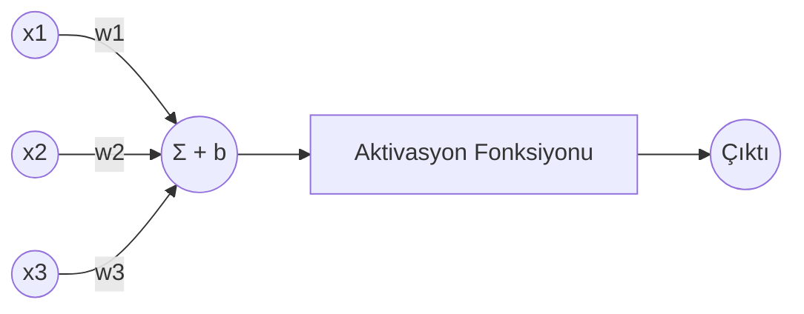
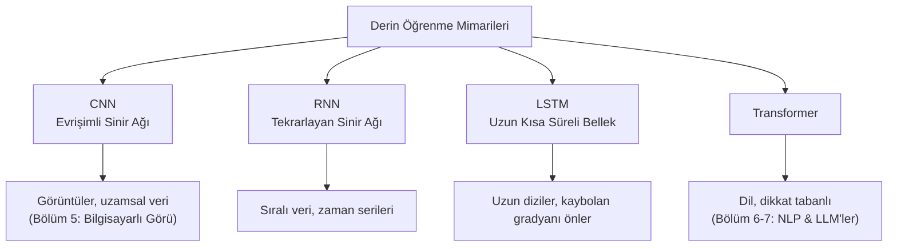

# Bölüm 03 — Derin Öğrenme 🧬

[⬅ Önceki: Makine Öğrenmesi](../02-Machine-Learning/README.md) | [⬅ Yol Haritası](../README.md) | [➡ Sonraki: Sinir Ağları Derin İnceleme](../04-Neural-Networks/README.md)

---

| 🎯 Zorluk | ⏱️ Tahmini Süre | 📋 Ön Koşullar | 🏆 Kazanımlar |
|---|---|---|---|
| Orta–İleri | 8–10 saat | Bölüm 2 + temel lineer cebir/kalkülüs | Sinir ağı mimarisi, backprop matematiği, sıfırdan uygulama |


## 📖 Giriş

Bölüm 2'nin modelleri (karar ağaçları, doğrusal regresyon) *insanların*
iyi özellikler seçmesine dayanır. Derin Öğrenme bu gereksinimi ortadan
kaldırır: yapay nöronların katmanlı yığınları, kendi iç temsillerini
doğrudan ham verilerden öğrenir — modern görüntü tanıma, konuşma tanıma
ve dil modellerini güçlendiren şey budur.

## 🎯 Öğrenme Hedefleri

- [ ] Nöronları, katmanları, ağırlıkları ve yanlılıkları (bias) açıklamak
- [ ] Aktivasyon fonksiyonlarını ve doğrusal olmamanın neden önemli olduğunu açıklamak
- [ ] İleri yayılımı ve geri yayılımı kavramsal ve matematiksel olarak anlamak
- [ ] Gradyan inişini ve kayıp fonksiyonlarını anlamak
- [ ] CNN, RNN, LSTM ve Transformer mimarilerini tanımak ve her birinin ne için iyi olduğunu bilmek
- [ ] Her gradyanı anlayarak NumPy ile sıfırdan bir sinir ağı inşa etmek

---

## 🧠 Temel Teori

### Tek Bir Nörondan Bir Ağa



Tek bir yapay nöron şunu hesaplar:

```
z = (w1*x1 + w2*x2 + ... + wn*xn) + b
a = aktivasyon(z)
```

Burada **w** (ağırlıklar) ve **b** (yanlılık/bias) öğrenilebilir
parametrelerdir ve `aktivasyon()` doğrusal olmama özelliği getirir —
bu olmadan, katmanları üst üste yığmak, kaç katman eklerseniz ekleyin
matematiksel olarak tek bir doğrusal fonksiyona çökerdi.

### Yaygın Aktivasyon Fonksiyonları

| Fonksiyon | Formül | Tipik Kullanım |
|----------|---------|--------------|
| Sigmoid | `1 / (1 + e^-x)` | İkili sınıflandırma için çıktı katmanı |
| Tanh | `(e^x - e^-x)/(e^x + e^-x)` | Gizli katmanlar (sıfır merkezli) |
| ReLU | `max(0, x)` | Günümüzde gizli katmanlarda en yaygın (hızlı, kaybolan gradyanları önler) |
| Softmax | bir vektörü olasılıklara normalize eder | Çok sınıflı sınıflandırma için çıktı katmanı |

### İleri Yayılım ve Geri Yayılım

```mermaid
flowchart LR
    subgraph Forward["İleri Yayılım"]
      direction LR
      I[Girdi] --> H[Gizli Katman(lar)] --> O[Çıktı / Tahmin]
    end
    O --> L["Kayıp Fonksiyonu<br/>(tahmini gerçekle karşılaştırır)"]
    L -->|Geri yayılım: gradyanlar geriye akar| H
    H -->|ağırlıkları güncelle| I2[Güncellenmiş Ağırlıklar]
```

1. **İleri yayılım** — girdi verisi ağdan katman katman geçerek bir tahmin üretir.
2. **Kayıp fonksiyonu** — tahminin ne kadar yanlış olduğunu ölçer (örn. Ortalama Kare Hata, Çapraz Entropi).
3. **Geri yayılım** — her ağırlığın hataya ne kadar katkıda bulunduğunu, katman katman geriye doğru hesaplamak için kalkülüsün zincir kuralı kullanılır.
4. **Gradyan İnişi** — her ağırlık, kaybı azaltacak yönde hafifçe itilir: `w = w - öğrenme_oranı * gradyan`.

Bu ileri → kayıp → geri → güncelleme döngüsü bir **eğitim adımıdır** ve
kayıp iyileşmeyi durdurana kadar birçok **epok (epoch)** boyunca
tekrarlanır.

### Kayıp Fonksiyonları ve Optimize Ediciler

| Kayıp Fonksiyonu | Kullanım Alanı |
|----------------|-----------|
| Ortalama Kare Hata (MSE) | Regresyon |
| İkili Çapraz Entropi | İkili sınıflandırma |
| Kategorik Çapraz Entropi | Çok sınıflı sınıflandırma |

| Optimize Edici | Fikir |
|-----------|------|
| SGD (Stokastik Gradyan İnişi) | Yukarıdaki temel ağırlık güncelleme kuralı |
| Momentum | Gürültülü güncellemeleri yumuşatmak için "hız" ekler |
| Adam | Momentum + parametre başına uyarlanabilir öğrenme oranlarını birleştirir (günümüzde en popüler varsayılan) |

### Ana Mimarilere Genel Bakış



| Mimari | En İyi Olduğu Alan | Anahtar Fikir |
|---------------|----------|----------|
| **CNN** | Görüntüler | Evrişim filtreleri yerel uzamsal desenleri (kenarlar, dokular) tespit eder |
| **RNN** | Diziler | Zaman adımları boyunca bilgiyi taşıyan gizli bir durum tutar |
| **LSTM** | Uzun diziler | Kapı mekanizması RNN'lerin kaybolan gradyan problemini çözer |
| **Transformer** | Dil ve ötesi | Öz-dikkat (self-attention), her token'ın doğrudan diğer tüm token'lara bakmasını sağlar |

> 💡 **İpucu:** Burada CNN'leri/RNN'leri/Transformer'ları tamamen
> öğrenmenize gerek yok — bunlar Bölüm 5, 6 ve 7'de özel olarak derinlemesine
> incelenecek. Bu bölümün görevi, hepsini güçlendiren eğitim döngüsünü
> derinlemesine anlamanızı sağlamaktır.

---

## 💻 Python Örnekleri

| # | Örnek | Dosya | Kavram |
|---|-------|-------|---------|
| 1 | Sıfırdan Sinir Ağı | [`01_neural_network_from_scratch.py`](examples/01_neural_network_from_scratch.py) | XOR problemi üzerinde NumPy ile manuel olarak uygulanan ileri yayılım/geri yayılım/gradyan inişi |

```bash
pip install numpy
cd 03-Deep-Learning/examples
python 01_neural_network_from_scratch.py
```

> 🚧 **Yakında:** Bu ağın TensorFlow/Keras ve PyTorch eşdeğerleri, ayrıca
> bir MNIST rakam sınıflandırıcı projesi bu klasöre eklenecek — katkılarınızı
> bekliyoruz!

---

## 🏋️ Alıştırmalar ve 🎯 Mini Proje

1. Örnek 1'de `hidden_size`'ı 4'ten 2'ye değiştirin — ağ hâlâ XOR'u öğrenebiliyor mu? Daha az nöron neden kapasiteyi olumsuz etkileyebilir?
2. `sigmoid` aktivasyonunu `tanh` ile değiştirin ve eğitim hızının nasıl değiştiğini gözlemleyin.
3. Sıfırdan yapılan ağa ikinci bir gizli katman ekleyin (bu hem `forward()`'ı hem de `backward()`'ı genişletmeyi gerektirir).
4. **Mini Proje:** Aynı XOR ağını TensorFlow/Keras veya PyTorch ile ~15 satırda yeniden uygulayın ve eğitim hızını/okunabilirliğini sıfırdan yapılan versiyonla karşılaştırın.

---

## 🧪 Quiz

[`quizzes/`](quizzes/) klasörüne bakın — bu bölüm büyüdükçe aktivasyon
fonksiyonları, geri yayılım, kayıp fonksiyonları ve mimari seçimi
konularında sorular ekleyin.

---

## 📌 Özet ve Önemli Çıkarımlar

- Bir nöron = ağırlıklı toplam + yanlılık + aktivasyon fonksiyonu; "derin" yığınlamayı anlamlı kılan şey doğrusal olmamadır.
- Geri yayılım, her ağırlığın kaybı nasıl etkilediğini hesaplamak için zincir kuralını kullanır; gradyan inişi daha sonra bu kaybı azaltmak için her ağırlığı günceller.
- CNN'ler uzamsal verilerde (görüntüler) uzmanlaşır, RNN'ler/LSTM'ler dizilerde uzmanlaşır ve Transformer'lar tüm öğeler arasındaki ilişkileri aynı anda modellemek için dikkat (attention) kullanır.
- TensorFlow/PyTorch'un perde arkasında yaptığı her şey, Örnek 1'in manuel olarak yaptığının tam olarak aynısıdır — sadece GPU hızlandırmasıyla devasa ölçekte.

## 📚 Önerilen Okumalar ve Kaynaklar

- Goodfellow, Bengio, Courville — *Deep Learning* ("Derin Öğrenme İncili", çevrimiçi ücretsiz)
- 3Blue1Brown — *Neural Networks* video serisi (mükemmel görsel sezgi)
- Nielsen, M. — *Neural Networks and Deep Learning* (çevrimiçi ücretsiz kitap)
- PyTorch dokümantasyonu: https://pytorch.org/docs/
- TensorFlow/Keras dokümantasyonu: https://www.tensorflow.org/guide/keras

---

[⬅ Önceki: Makine Öğrenmesi](../02-Machine-Learning/README.md) | [⬅ Yol Haritası](../README.md) | [➡ Sonraki: Sinir Ağları Derin İnceleme](../04-Neural-Networks/README.md)
