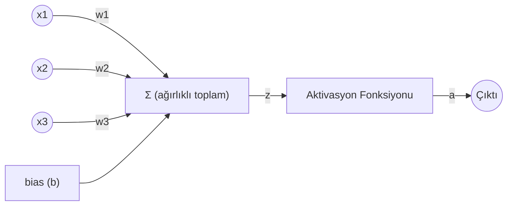
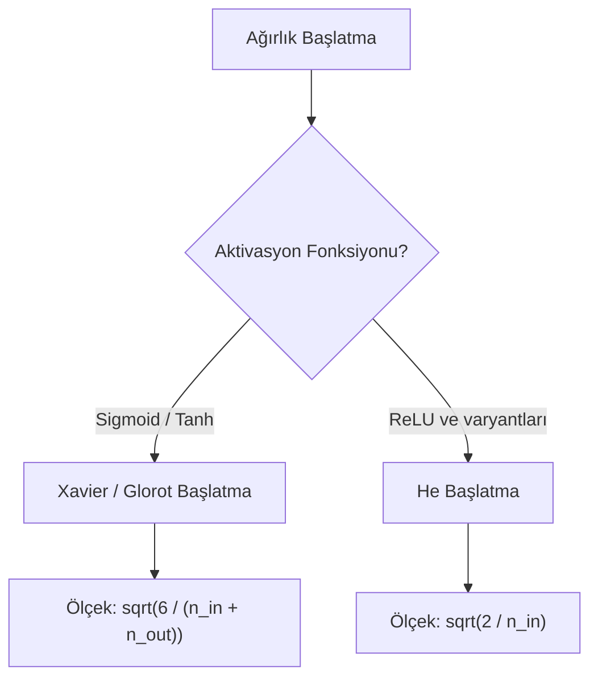
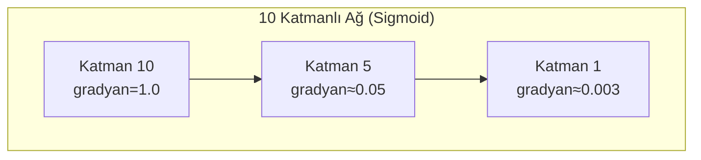
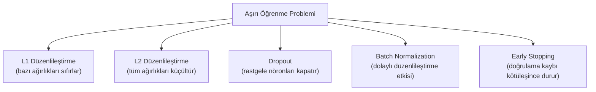
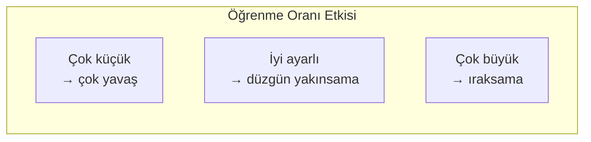

# Bölüm 04 — Sinir Ağları Derin İnceleme 🔬

[⬅ Önceki: Derin Öğrenme](../03-Deep-Learning/README.md) | [⬅ Yol Haritası](../README.md) | [➡ Sonraki: Bilgisayarlı Görü](../05-Computer-Vision/README.md)

---

| 🎯 Zorluk | ⏱️ Tahmini Süre | 📋 Ön Koşullar | 🏆 Kazanımlar |
|---|---|---|---|
| Orta–İleri | 6–8 saat | Bölüm 3 (ileri/geri yayılım, gradyan inişi temelleri) | Ağırlık başlatma, düzenlileştirme, dropout, batch norm, hiperparametre ayarı, gerçek bir MLP sınıflandırıcı |

## 📖 Giriş

Bölüm 3'te bir sinir ağını sıfırdan eğitip çalıştırdık. Ama gerçek dünyada
bir ağ ne zaman **öğrenmeyi reddeder**? Ne zaman **aşırı öğrenir**? Neden
bazı ağlar 100 katmanla bile eğitilebilirken bazıları 10 katmanda
"patlar"? Bu bölüm, bir sinir ağını *çalıştırmak* ile onu *doğru
çalıştırmak* arasındaki farkı kapatan pratik mühendislik tekniklerini ele
alıyor.

## 🎯 Öğrenme Hedefleri

- [ ] Bir nöronun matematiğini adım adım (elle) hesaplayabilmek
- [ ] Aktivasyon fonksiyonlarının doygunlaşma ve gradyan davranışlarını karşılaştırmak
- [ ] Ağırlık başlatma stratejilerinin (Xavier, He) neden ve ne zaman gerekli olduğunu açıklamak
- [ ] Kaybolan/patlayan gradyan problemini sayısal olarak gözlemlemek ve çözümlerini uygulamak
- [ ] L1/L2 düzenlileştirme, Dropout ve Batch Normalization'ı sıfırdan uygulamak
- [ ] Parti boyutu ve öğrenme oranının eğitim dinamiklerini nasıl etkilediğini analiz etmek
- [ ] Bu tekniklerin tümünü gerçek bir MLP sınıflandırıcıda (el yazısı rakamlar) birleştirmek

---

## 🧠 Temel Teori

### Bir Nöronun Anatomisi (Detaylı)

Bölüm 3'te bir nöronu tanıttık; şimdi her adımı ayrıntılı inceleyelim:



```
z = (x1*w1 + x2*w2 + x3*w3) + b     ← "ağırlıklı toplam"
a = aktivasyon(z)                    ← "nöronun çıktısı"
```

`w` (ağırlıklar) her girdinin ne kadar önemli olduğunu, `b` (bias) ise
nöronun "ne kadar kolay tetikleneceğini" kontrol eder — girdiler sıfır
olsa bile nöronun aktif olup olmayacağını belirler.

### Ağırlık Başlatma: Neden Önemli?

Ağırlıkları rastgele ama **yanlış ölçekte** başlatmak, bir ağın hiç
öğrenememesine yol açabilir:



| Strateji | Formül | Kullanım |
|----------|--------|----------|
| Naif (sabit varyans) | `N(0, 1)` | ❌ Genellikle kötü — çok büyük veya çok küçük |
| Xavier/Glorot | `U(-√(6/(n_in+n_out)), √(6/(n_in+n_out)))` | Sigmoid, Tanh |
| He | `N(0, √(2/n_in))` | ReLU, Leaky ReLU |

### Kaybolan / Patlayan Gradyan



Geri yayılımda gradyan, zincir kuralı gereği her katmanda çarpılır.
Sigmoid'in türevi en fazla 0.25 olduğundan, 10 katmanlı bir ağda
`0.25^10 ≈ 0.000001` gibi bir çarpan ortaya çıkar — girdiye yakın
katmanlar pratik olarak hiç güncellenmez. Bu, **ReLU'nun**, **He
başlatmanın** ve **Batch Normalization'ın** neden modern derin ağlarda
neredeyse zorunlu hale geldiğini açıklar.

### Düzenlileştirme (Regularization): Aşırı Öğrenmeyle Mücadele



| Teknik | Nasıl Çalışır | Ne Zaman Kullanılır |
|--------|----------------|----------------------|
| **L1 (Lasso)** | `kayıp += alpha * Σ|w|` | Özellik seçimi de isteniyorsa |
| **L2 (Ridge / Weight Decay)** | `kayıp += alpha * Σw²` | Genel amaçlı, en yaygın |
| **Dropout** | Eğitimde rastgele nöronları geçici kapatır | Derin ağlarda, özellikle tam bağlantılı katmanlarda |
| **Batch Normalization** | Aktivasyonları mini-parti içinde normalize eder | Derin ağların eğitimini hızlandırmak/kararlılaştırmak için |
| **Early Stopping** | Doğrulama kaybı iyileşmeyi bırakınca eğitimi durdurur | Hemen hemen her zaman uygulanabilir, ücretsiz bir güvenlik ağı |

### Hiperparametre Ayarı: Öğrenme Oranı ve Parti Boyutu



| Parti Boyutu | Özellik |
|----------------|---------|
| Toplu (tüm veri) | En kararlı gradyan, en yavaş (epok başına 1 güncelleme) |
| Mini-Parti (16-256) | Hız/kararlılık dengesi — pratikte standart tercih |
| Stokastik (1 örnek) | En hızlı güncelleme, en gürültülü |

> 💡 **İpucu:** Modern optimize ediciler (Adam gibi) öğrenme oranını
> otomatik ayarlar, ama sabit bir `lr` kullanıyorsanız bile bu dinamikleri
> anlamak, eğitiminiz beklenmedik şekilde ıraksadığında hata ayıklamanızı
> sağlar.

---

## 📁 Bu Bölümün Klasör Yapısı

```
04-Neural-Networks/
├── README.md          ← teori, diyagramlar, tam anlatım (bu dosya)
├── examples/            ← 10 çalıştırılabilir Python örneği
├── exercises/            ← başlangıç/orta/ileri alıştırmalar
├── solutions/            ← alıştırma çözümleri
├── quizzes/              ← quiz.md + quiz_answers.md (20 soru)
├── projects/             ← kapsamlı "Hiperparametre Laboratuvarı" projesi
├── notebooks/            ← etkileşimli Jupyter Notebook sürümü
├── datasets/              ← (bu bölüm scikit-learn'ün yerleşik digits veri setini kullanır)
├── images/                ← diyagramlar için statik görseller
└── resources/             ← ek okuma listeleri, kopya kağıtları
```

## 💻 Python Örnekleri

| # | Örnek | Dosya | Öne Çıkan Kavram |
|---|-------|-------|---------------------|
| 1 | Tek Nöronun Matematiği | [`01_single_neuron_math.py`](examples/01_single_neuron_math.py) | İleri yayılımın 4 adımı, elle takip edilebilir |
| 2 | Aktivasyon Fonksiyonları | [`02_activation_functions.py`](examples/02_activation_functions.py) | Sigmoid/Tanh/ReLU/Leaky ReLU/Softmax karşılaştırması |
| 3 | Ağırlık Başlatma | [`03_weight_initialization.py`](examples/03_weight_initialization.py) | Naif vs. Xavier vs. He başlatma |
| 4 | Kaybolan Gradyan Gösterimi | [`04_vanishing_gradient_demo.py`](examples/04_vanishing_gradient_demo.py) | 10 katmanlı ağda gradyan büyüklüğü izleme |
| 5 | L1/L2 Düzenlileştirme | [`05_l1_l2_regularization.py`](examples/05_l1_l2_regularization.py) | Ridge/Lasso ile aşırı öğrenmeyi önleme |
| 6 | Sıfırdan Dropout | [`06_dropout_from_scratch.py`](examples/06_dropout_from_scratch.py) | Inverted dropout matematiği |
| 7 | Sıfırdan Batch Normalization | [`07_batch_normalization.py`](examples/07_batch_normalization.py) | Eğitim/test modu farkı, gamma/beta |
| 8 | Parti Boyutu Etkisi | [`08_mini_batch_gradient_descent.py`](examples/08_mini_batch_gradient_descent.py) | Toplu vs. mini-parti vs. SGD |
| 9 | Öğrenme Oranı Etkisi | [`09_learning_rate_effects.py`](examples/09_learning_rate_effects.py) | Yavaş yakınsama, iyi yakınsama, ıraksama |
| 10 | MLP Rakam Sınıflandırıcı | [`10_mlp_digit_classifier.py`](examples/10_mlp_digit_classifier.py) | Tüm kavramları birleştiren gerçek bir proje (%96 doğruluk) |

```bash
pip install numpy scikit-learn matplotlib
cd 04-Neural-Networks/examples
python 01_single_neuron_math.py
```

## 🏋️ Alıştırmalar

Başlangıç/Orta/İleri seviyeli 10 alıştırma: [`exercises/exercises.md`](exercises/exercises.md)

## 💡 Çözümler

[`solutions/exercise_solutions.py`](solutions/exercise_solutions.py) — hesaplama gerektiren alıştırmaların referans çözümleri.

## 📓 Etkileşimli Notebook

[`notebooks/04_neural_networks.ipynb`](notebooks/04_neural_networks.ipynb)

## 🧪 Quiz

- Sorular: [`quizzes/quiz.md`](quizzes/quiz.md) (20 soru)
- Cevaplar: [`quizzes/quiz_answers.md`](quizzes/quiz_answers.md)

## 🚀 Kapsamlı Proje

[`projects/hyperparameter_lab.md`](projects/hyperparameter_lab.md) — "Hiperparametre Laboratuvarı": bu bölümdeki tüm teknikleri birleştirip sistematik bir deney tasarlayarak en iyi model yapılandırmasını bilimsel olarak bulun.

---

## 📌 Özet ve Önemli Çıkarımlar

- Ağırlık başlatma, kaybolan/patlayan gradyan problemlerini önlemede kritik rol oynar — aktivasyon fonksiyonunuza uygun stratejiyi (Xavier veya He) seçin.
- Kaybolan gradyan problemi, derin ağlarda zincir kuralı yüzünden küçük türevlerin tekrar tekrar çarpılmasından kaynaklanır; ReLU, uygun başlatma ve Batch Normalization bu problemi büyük ölçüde azaltır.
- L1/L2, Dropout, Batch Normalization ve Early Stopping, aşırı öğrenmeyle mücadelenin farklı ama tamamlayıcı araçlarıdır — genellikle birlikte kullanılırlar.
- Öğrenme oranı ve parti boyutu, eğitim hızı ile kararlılık arasındaki dengeyi doğrudan kontrol eden en kritik hiperparametrelerdir.
- Gerçek dünyada bir model eğitmek, "bir kere çalıştırıp bitirmek" değil, bu tekniklerin sistematik olarak denenip ayarlandığı yinelemeli bir süreçtir (bkz. Kapsamlı Proje).

## 📚 Önerilen Okumalar ve Kaynaklar

- Glorot, X. & Bengio, Y. (2010). *Understanding the difficulty of training deep feedforward neural networks* (Xavier başlatmanın orijinal makalesi)
- He, K. et al. (2015). *Delving Deep into Rectifiers* (He başlatmanın orijinal makalesi)
- Srivastava, N. et al. (2014). *Dropout: A Simple Way to Prevent Neural Networks from Overfitting*
- Ioffe, S. & Szegedy, C. (2015). *Batch Normalization: Accelerating Deep Network Training*
- Goodfellow, Bengio, Courville — *Deep Learning*, Bölüm 8 (Optimizasyon) ve Bölüm 7 (Düzenlileştirme)
- scikit-learn MLPClassifier dokümantasyonu: https://scikit-learn.org/stable/modules/neural_networks_supervised.html

---

[⬅ Önceki: Derin Öğrenme](../03-Deep-Learning/README.md) | [⬅ Yol Haritası](../README.md) | [➡ Sonraki: Bilgisayarlı Görü](../05-Computer-Vision/README.md)
