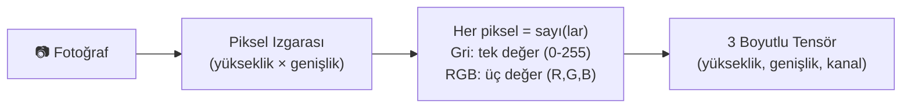
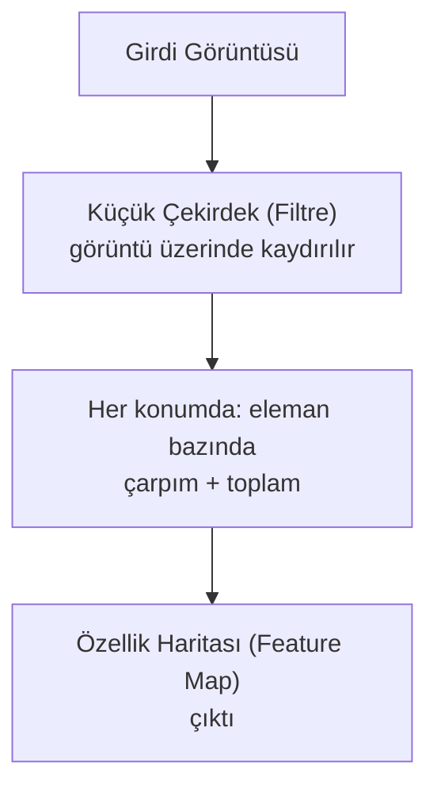
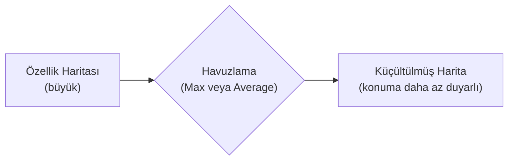
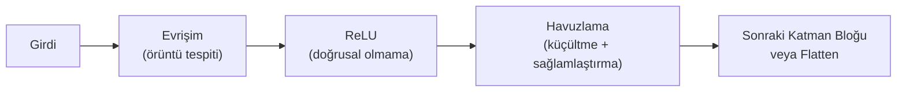
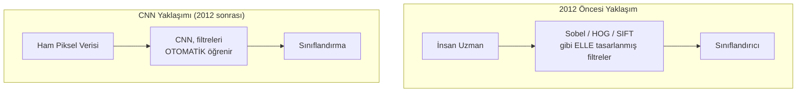
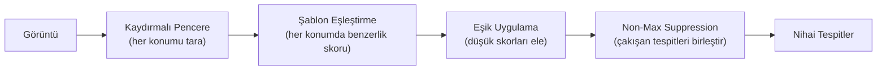

# Bölüm 05 — Bilgisayarlı Görü 👁️

[⬅ Önceki: Sinir Ağları](../04-Neural-Networks/README.md) | [⬅ Yol Haritası](../README.md) | [➡ Sonraki: Doğal Dil İşleme](../06-NLP/README.md)

---

| 🎯 Zorluk | ⏱️ Tahmini Süre | 📋 Ön Koşullar | 🏆 Kazanımlar |
|---|---|---|---|
| İleri | 8–10 saat | Bölüm 4 (Sinir Ağları) | Evrişim matematiği, havuzlama, kenar tespiti, CNN mimarisi mantığı, veri artırma, gerçek bir görüntü sınıflandırma projesi |

## 📖 Giriş

Bir insan bir fotoğrafa baktığında saniyeler içinde neyi gördüğünü
anlar. Bir bilgisayar için bu görüntü sadece bir sayı yığınıdır. Bu
bölüm, o sayı yığınından anlamlı örüntüler (kenarlar, dokular, nesneler)
çıkarmanın matematiğini -- evrişim, havuzlama ve bunların üzerine inşa
edilen CNN mimarisini -- sıfırdan ele alıyor.

## 🎯 Öğrenme Hedefleri

- [ ] Görüntülerin bilgisayar belleğinde nasıl bir piksel tensörü olarak temsil edildiğini açıklamak
- [ ] 2D evrişim işlemini sıfırdan uygulayabilmek ve klasik çekirdekleri (blur, sharpen, edge) anlamak
- [ ] Max/Average Pooling'in amacını ve "translation invariance" kavramını açıklamak
- [ ] Sobel operatörüyle kenar tespiti yapabilmek
- [ ] Standart bir görüntü ön işleme hattı kurabilmek
- [ ] Veri artırma tekniklerini uygulayabilmek
- [ ] Bir CNN katman bloğunun (Conv → ReLU → Pool) ileri geçişini uçtan uca takip edebilmek
- [ ] Elle tasarlanmış özellikler ile öğrenilen özellikler arasındaki farkı kavramak
- [ ] Basit bir nesne tespit sisteminin (kaydırmalı pencere + NMS) nasıl çalıştığını anlamak
- [ ] Bu kavramların tümünü gerçek bir görüntü sınıflandırma projesinde birleştirmek

---

## 🧠 Temel Teori

### Bir Görüntü, Bir Sayı Dizisidir



Bir CNN'in "gördüğü" şey bir yüz veya bir kedi değil, milyonlarca sayının
matematiksel bir düzenidir. Bu bölümdeki her teknik, bu ham sayı dizisi
üzerinde çalışır.

### Evrişim (Convolution): CNN'lerin Kalbi



```
çıktı_boyutu = girdi_boyutu - çekirdek_boyutu + 1     (padding olmadan)
```

| Çekirdek Türü | Etki |
|---|---|
| Bulanıklaştırma (Blur) | Komşu piksellerin ortalamasını alır → yumuşatır |
| Keskinleştirme (Sharpen) | Merkez pikseli vurgular → kontrastı artırır |
| Kenar Tespiti (Edge) | Ani parlaklık değişimlerini vurgular |
| Sobel X / Y | Yatay/dikey yöndeki gradyanı (değişim hızını) ölçer |

> 💡 Elle tasarladığımız bu çekirdekler, bir CNN'de **öğrenilebilir
> parametrelerdir** — ağ, hangi çekirdek değerlerinin en faydalı
> örüntüleri yakaladığını eğitim sırasında otomatik olarak keşfeder.

### Havuzlama (Pooling): Küçült ve Sağlamlaştır



Havuzlama iki şey yapar: **(1)** hesaplama maliyetini azaltır (boyutu
küçültür), **(2)** ağa küçük konum kaymalarına karşı dayanıklılık
kazandırır (bir kenar birkaç piksel kaysa bile çıktı büyük ölçüde aynı
kalır).

### Bir CNN Katman Bloğunun Anatomisi



Bu üçlü blok (Conv → ReLU → Pool) derinlik boyunca tekrarlanır. İlk
katmanlar basit örüntüler (kenar, renk geçişi) öğrenir; derin katmanlar
bunları birleştirerek gittikçe daha soyut örüntüler (göz, tekerlek,
yüz) öğrenir — bu, CNN'lerin **hiyerarşik öğrenme** özelliğidir.

### Elle Tasarlanmış Özellikler vs. Öğrenilen Özellikler



2012'de AlexNet'in ImageNet yarışmasını büyük bir farkla kazanması, bu
geçişi tetikledi ve derin öğrenme çağını başlattı.

### Veri Artırma: Sınırlı Veriden Daha Fazlasını Çıkarmak

| Teknik | Ne Simüle Eder |
|---|---|
| Yatay/Dikey Çevirme | Kameranın/nesnenin farklı yönelimi |
| Döndürme | Nesnenin eğik açıdan görülmesi |
| Parlaklık/Kontrast Değişimi | Farklı ışıklandırma koşulları |
| Gauss Gürültüsü | Kamera/sensör gürültüsü |
| Rastgele Kırpma | Nesnenin görüntüde farklı konumda olması |

### Nesne Tespiti: Kaydırmalı Pencere + Non-Max Suppression



---

## 📁 Bu Bölümün Klasör Yapısı

```
05-Computer-Vision/
├── README.md          ← teori, diyagramlar, tam anlatım (bu dosya)
├── examples/            ← 10 çalıştırılabilir Python örneği
├── exercises/            ← başlangıç/orta/ileri alıştırmalar
├── solutions/            ← alıştırma çözümleri
├── quizzes/              ← quiz.md + quiz_answers.md (20 soru)
├── projects/             ← kapsamlı "Görüntü Sınıflandırma Hattı" projesi
├── notebooks/            ← etkileşimli Jupyter Notebook sürümü
├── datasets/              ← veri seti bilgilendirmesi (yerleşik skimage/sklearn verileri kullanılır)
├── images/                ← diyagramlar için statik görseller
└── resources/             ← ek okuma listeleri, kopya kağıtları
```

## 💻 Python Örnekleri

| # | Örnek | Dosya | Öne Çıkan Kavram |
|---|-------|-------|---------------------|
| 1 | Piksel Tensörü Olarak Görüntü | [`01_image_as_pixels.py`](examples/01_image_as_pixels.py) | Görüntü temsili, kanallar, piksel erişimi |
| 2 | Sıfırdan Evrişim | [`02_convolution_from_scratch.py`](examples/02_convolution_from_scratch.py) | 2D evrişim matematiği, blur/sharpen/edge çekirdekleri |
| 3 | Havuzlama İşlemleri | [`03_pooling_operations.py`](examples/03_pooling_operations.py) | Max/Average Pooling, elle takip edilebilir örnek |
| 4 | Sobel Kenar Tespiti | [`04_edge_detection_sobel.py`](examples/04_edge_detection_sobel.py) | Gradyan hesaplama, kenar haritası |
| 5 | Görüntü Ön İşleme Hattı | [`05_image_preprocessing_pipeline.py`](examples/05_image_preprocessing_pipeline.py) | Yeniden boyutlandırma, normalizasyon, toplu işleme |
| 6 | Veri Artırma | [`06_data_augmentation.py`](examples/06_data_augmentation.py) | Çevirme, döndürme, gürültü, rastgele kırpma |
| 7 | CNN Katmanı İleri Geçişi | [`07_conv_layer_forward_pass.py`](examples/07_conv_layer_forward_pass.py) | Conv+ReLU+Pool zinciri, boyut takibi, Flatten |
| 8 | Elle Tasarlanmış vs. Ham Özellikler | [`08_handcrafted_features_vs_raw_pixels.py`](examples/08_handcrafted_features_vs_raw_pixels.py) | Sobel özellik mühendisliği karşılaştırması |
| 9 | Kaydırmalı Pencere Nesne Tespiti | [`09_sliding_window_object_detection.py`](examples/09_sliding_window_object_detection.py) | Şablon eşleştirme, Non-Max Suppression |
| 10 | Uçtan Uca Sınıflandırma Projesi | [`10_image_classification_project.py`](examples/10_image_classification_project.py) | Tüm kavramları birleştiren gerçek proje (%97 doğruluk) |

```bash
pip install numpy scipy scikit-learn scikit-image matplotlib
cd 05-Computer-Vision/examples
python 01_image_as_pixels.py
```

## 🏋️ Alıştırmalar

Başlangıç/Orta/İleri seviyeli 10 alıştırma: [`exercises/exercises.md`](exercises/exercises.md)

## 💡 Çözümler

[`solutions/exercise_solutions.py`](solutions/exercise_solutions.py) — hesaplama gerektiren alıştırmaların referans çözümleri.

## 📓 Etkileşimli Notebook

[`notebooks/05_computer_vision.ipynb`](notebooks/05_computer_vision.ipynb)

## 🧪 Quiz

- Sorular: [`quizzes/quiz.md`](quizzes/quiz.md) (20 soru)
- Cevaplar: [`quizzes/quiz_answers.md`](quizzes/quiz_answers.md)

## 🚀 Kapsamlı Proje

[`projects/image_classification_pipeline.md`](projects/image_classification_pipeline.md) — özellik mühendisliği ve veri artırma stratejilerini sistematik olarak karşılaştırarak en iyi görüntü sınıflandırma hattını bulun.

---

## 📌 Özet ve Önemli Çıkarımlar

- Bir görüntü, bir bilgisayar için sadece bir sayı dizisidir (tensör) — CNN'lerin "gördüğü" şey bu sayıların matematiksel örüntüleridir.
- Evrişim, küçük öğrenilebilir filtrelerin görüntü üzerinde kaydırılarak örüntü tespit etmesidir; havuzlama bu bilgiyi küçültüp konum değişikliklerine karşı dayanıklı hale getirir.
- CNN'ler, 2012 öncesinin elle tasarlanmış özellik çıkarma yöntemlerini (Sobel, HOG), örüntüleri VERİDEN OTOMATİK öğrenerek geride bıraktı.
- Veri artırma, sınırlı eğitim verisinden daha fazla "öğrenme sinyali" çıkarmanın ücretsiz ve etkili bir yoludur.
- Nesne tespiti, "bu görüntüde ne var" sorusunun ötesinde "NEREDE var" sorusunu da yanıtlar; kaydırmalı pencere + Non-Max Suppression bunun temel (ama yavaş) bir çözümüdür.
- Gerçek bir bilgisayarlı görü projesi, tek bir modeli eğitip bitirmek değil, ön işleme + özellik mühendisliği + veri artırma seçimlerini sistematik olarak ölçüp karşılaştırmaktır (bkz. Kapsamlı Proje).

## 📚 Önerilen Okumalar ve Kaynaklar

- Krizhevsky, Sutskever, Hinton (2012) — *ImageNet Classification with Deep Convolutional Neural Networks* (AlexNet)
- LeCun et al. (1998) — *Gradient-Based Learning Applied to Document Recognition* (LeNet)
- He et al. (2015) — *Deep Residual Learning for Image Recognition* (ResNet)
- Dalal & Triggs (2005) — *Histograms of Oriented Gradients for Human Detection* (HOG)
- Stanford CS231n — Convolutional Neural Networks for Visual Recognition: http://cs231n.stanford.edu/
- scikit-image dokümantasyonu: https://scikit-image.org/

---

[⬅ Önceki: Sinir Ağları](../04-Neural-Networks/README.md) | [⬅ Yol Haritası](../README.md) | [➡ Sonraki: Doğal Dil İşleme](../06-NLP/README.md)
