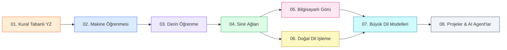

<div align="center">

# 🧠 AI Learning Roadmap
### Yapay Zeka Öğrenme Yol Haritası

**Kural Tabanlı Sistemlerden Büyük Dil Modellerine — Sıfırdan Uzmanlığa Açık Kaynak Bir Yapay Zeka Müfredatı**

[](https://www.python.org/)
[](LICENSE)
[](.github/workflows/ci.yml)
[](CONTRIBUTING.md)
[](CONTRIBUTING.md)
[](#-öğrenme-yolları)
[](https://jupyter.org/)
[](CONTRIBUTING.md)

**Teori + Matematik + Çalışan Python Kodu — hepsi tek bir depoda.**

[🚀 Başlarken](#-başlarken) • [🗺️ Yol Haritası](#️-yol-haritası) • [📁 Yapı](#-depo-yapısı) • [🤝 Katkıda Bulun](#-katkıda-bulunma) • [❓ SSS](#-sık-sorulan-sorular)

</div>

---

## 📌 Bu Proje Nedir?

**AI Learning Roadmap**, yapay zekayı en temelden (basit `if/else` kuralları)
en güncel teknolojilere (Büyük Dil Modelleri ve AI Agent'lar) kadar sırayla
öğreten, açık kaynaklı, topluluk tarafından geliştirilen bir eğitim
platformudur. Bir ders kitabı ile etkileşimli bir kodlama laboratuvarının
birleşimi gibi düşünün: her bölüm teori, matematik, diyagramlar ve
çalıştırılabilir Python kodunu bir araya getirir.

> 💡 Bu depo hem **öğrenmek** için hem de bir **GitHub portföy projesi**
> olarak kullanılabilecek şekilde tasarlandı.

---

## ✨ Özellikler

| | |
|---|---|
| 📚 **8 Kapsamlı Bölüm** | Kural Tabanlı YZ'den AI Agent'lara kadar tam bir müfredat |
| 💻 **Çalışan Python Kodu** | Her örnek test edilmiş, PEP 8 uyumlu, type hint ve docstring içerir |
| 📓 **Jupyter Notebook Desteği** | Etkileşimli olarak hücre hücre çalıştırın |
| 🧪 **Quizler & Çözümler** | Her bölümde bilgi testleri ve referans çözümler |
| 🎯 **3 Seviyeli Alıştırmalar** | Başlangıç / Orta / İleri seviye pratik problemler |
| 🚀 **Gerçek Dünya Projeleri** | Spam Detector, Sentiment Analysis, RAG uygulaması ve daha fazlası |
| 🔄 **Otomatik CI/CD** | GitHub Actions ile lint, format ve test kontrolü |
| 🌍 **Türkçe İçerik** | Tamamen Türkçe, anadilinde öğrenme deneyimi |
| 🤝 **Açık Katkıya Uygun** | Net katkı rehberi ve tutarlı içerik standardı |

---

## 🗺️ Yol Haritası



## 📊 İlerleme Durumu

| # | Bölüm | Durum | Zorluk | Süre | Örnek Sayısı |
|---|-------|:-----:|:------:|:----:|:---:|
| 01 | [Kural Tabanlı YZ](01-Rule-Based-AI/README.md) | ✅ Tamamlandı | Başlangıç | 4–6 sa | 10 |
| 02 | [Makine Öğrenmesi](02-Machine-Learning/README.md) | ✅ Tamamlandı | Orta | 6–8 sa | 3 |
| 03 | [Derin Öğrenme](03-Deep-Learning/README.md) | ✅ Tamamlandı | Orta–İleri | 8–10 sa | 1 |
| 04 | [Sinir Ağları](04-Neural-Networks/README.md) | ✅ Tamamlandı | Orta–İleri | 6–8 sa | 10 |
| 05 | [Bilgisayarlı Görü](05-Computer-Vision/README.md) | 🚧 Planlandı | İleri | 8–10 sa | — |
| 06 | [Doğal Dil İşleme](06-NLP/README.md) | 🚧 Planlandı | İleri | 8–10 sa | — |
| 07 | [Büyük Dil Modelleri](07-LLMs/README.md) | 🚧 Planlandı | İleri | 10–12 sa | — |
| 08 | [Projeler & AI Agent'lar](08-Projects/README.md) | 🚧 Planlandı | Karma | Değişken | — |

> ✅ = teori + kod + quiz + çözümler tamamen yazıldı &nbsp;&nbsp; 🚧 = yapı, metaveri ve yol haritası hazır, içerik topluluk katkılarıyla büyüyor
>
> **Şeffaflık notu:** Bu, gerçek zamanlı gelişen bir proje. 01–03 arası bölümler tam derinlikte tamamlandı; 04–08 arası bölümler net planlanmış konu başlıkları, klasör iskeleti ve hedeflerle "katkıya hazır" durumda. İlerlemeyi [CHANGELOG.md](CHANGELOG.md) dosyasından takip edebilirsiniz.

---

## 📁 Depo Yapısı

Her bölüm **aynı standart klasör yapısını** kullanır — birini öğrendiğinizde hepsini bilirsiniz:

```
AI-Learning-Roadmap/
│
├── README.md                   ← şu an buradasınız
├── CONTRIBUTING.md              ← katkı rehberi
├── CODE_OF_CONDUCT.md           ← davranış kuralları
├── SECURITY.md                  ← güvenlik politikası
├── CHANGELOG.md                 ← sürüm geçmişi
├── LICENSE                      ← MIT Lisansı
├── pyproject.toml                ← ruff/pytest yapılandırması
│
├── .github/workflows/ci.yml      ← otomatik lint + test (GitHub Actions)
├── tests/                         ← depo genelindeki birim testleri
│
├── 01-Rule-Based-AI/               ← ✅ TAM (referans/altın standart bölüm)
│   ├── README.md                    ← teori + diyagramlar + tablo + metaveri
│   ├── examples/                     ← 10 çalıştırılabilir Python dosyası
│   ├── exercises/                    ← alıştırmalar
│   ├── solutions/                    ← çözümler
│   ├── quizzes/                      ← quiz + cevap anahtarı
│   ├── projects/                     ← kapsamlı mini proje
│   ├── notebooks/                    ← .ipynb sürümü
│   ├── datasets/                     ← örnek veri (gerekirse)
│   ├── images/                       ← diyagramlar
│   └── resources/                    ← ek kaynaklar
│
├── 02-Machine-Learning/            ← ✅ TAM
├── 03-Deep-Learning/               ← ✅ TAM
├── 04-Neural-Networks/             ← 🚧 iskelet hazır
├── 05-Computer-Vision/             ← 🚧 iskelet hazır
├── 06-NLP/                          ← 🚧 iskelet hazır
├── 07-LLMs/                         ← 🚧 iskelet hazır
├── 08-Projects/                    ← 🚧 iskelet hazır
│
└── Resources/                      ← ortak sözlük, okuma listesi, requirements.txt
```

---

## 📖 Her Bölüm Nasıl Düzenlenmiş?

1. **Metaveri tablosu** — zorluk seviyesi, tahmini süre, ön koşullar, kazanımlar
2. **Giriş** — ne öğreneceksiniz ve neden önemli
3. **Öğrenme Hedefleri** — bölüm için bir kontrol listesi
4. **Teori** — kavramlar, matematik ve tarih, sıfırdan anlatılır
5. **Diyagramlar** — Mermaid akış şemaları ve karşılaştırma tabloları
6. **Python Örnekleri** — tamamen yorumlanmış, type-hint'li, çalıştırılabilir
7. **Alıştırmalar** — başlangıç/orta/ileri seviyeli pratik problemler
8. **Çözümler** — referans çözümler
9. **Quiz** — anlayışı test etmek için 10–20 soru
10. **Notebook** — etkileşimli `.ipynb` sürümü
11. **Kapsamlı Proje** — gerçek dünya uygulaması
12. **Özet & Kaynaklar** — önemli çıkarımlar, kitaplar, makaleler, linkler

---

## 🚀 Başlarken

```bash
# 1. Depoyu klonlayın
git clone https://github.com/kullanici-adiniz/AI-Learning-Roadmap.git
cd AI-Learning-Roadmap

# 2. Sanal ortam oluşturun
python3 -m venv venv
source venv/bin/activate   # Windows: venv\Scripts\activate

# 3. Ortak bağımlılıkları kurun
pip install -r Resources/requirements.txt

# 4. (İsteğe bağlı) geliştirme bağımlılıklarını kurun
pip install ruff pytest jupyter

# 5. Bölüm 1 ile başlayın
cd 01-Rule-Based-AI
python examples/01_weather_assistant.py

# ...veya Jupyter Notebook'u açın
jupyter notebook notebooks/01_rule_based_ai.ipynb
```

### Testleri Çalıştırma

```bash
# Depo kökünden
pytest tests/ -v

# Kod stilini kontrol etme
ruff check .
```

---

## 🧩 Öğrenme Yolları

| Hedef | Önerilen Yol |
|-------|---------------|
| "Yapay zekayı kavramsal olarak anlamak istiyorum" | 01 → 02 → 03 (teori bölümleri) |
| "Veri Bilimci / ML Mühendisi olmak istiyorum" | 01 → 02 → 03 → 04 → 08 |
| "Bilgisayarlı görü üzerinde çalışmak istiyorum" | 01 → 02 → 03 → 04 → 05 → 08 |
| "Chatbot / NLP / LLM üzerinde çalışmak istiyorum" | 01 → 02 → 03 → 04 → 06 → 07 → 08 |
| "AI Agent'lar inşa etmek istiyorum" | 01 → 02 → 03 → 06 → 07 → 08 |

---

## 🎯 Planlanan Gerçek Dünya Projeleri

Bölümler tamamlandıkça aşağıdaki proje kategorileri her bölümün `projects/`
klasörüne eklenecek:

| Proje | İlişkili Bölüm |
|-------|------------------|
| Spam E-posta Tespit Sistemi | 02, 06 |
| IMDB Duygu Analizi (Sentiment Analysis) | 06 |
| MNIST / CIFAR-10 Görüntü Sınıflandırıcı | 04, 05 |
| Basit Yüz Tanıma / OCR | 05 |
| Nesne Tespiti (Object Detection) | 05 |
| Film/Ürün Öneri Sistemi | 02 |
| Kural Tabanlı → LLM Sohbet Botu Karşılaştırması | 01, 07 |
| RAG (Retrieval-Augmented Generation) Uygulaması | 06, 07 |
| Araç Kullanabilen (Tool-Use) AI Asistanı / Agent | 07, 08 |

---

## ⚠️ Notlar ve Kurallar

> **Not:** Tüm kodlar Python 3.10+ hedefler, [PEP 8](https://peps.python.org/pep-0008/)'e uyar ve `ruff` ile otomatik denetlenir.
>
> **Uyarı:** Derin Öğrenme bölümleri (03+) iyi bir CPU gerektirir; GPU önerilir ama zorunlu değildir.
>
> **İpucu:** Her `examples/` dosyası bağımsız çalıştırılabilir — tüm bölümü çalıştırmanıza gerek yok.

---

## 🤝 Katkıda Bulunma

Bu depo gerçek bir açık kaynak kurs gibi büyümek üzere tasarlandı. Katkıda
bulunmak son derece kolay:

1. Depoyu fork'layın
2. 🚧 işaretli bir bölüm seçin (bkz. [İlerleme Durumu](#-i̇lerleme-durumu))
3. [`01-Rule-Based-AI/`](01-Rule-Based-AI/) klasöründeki yapıyı ve kalite standardını referans alın
4. Detaylı rehber için [CONTRIBUTING.md](CONTRIBUTING.md) dosyasına bakın
5. Bir Pull Request açın

Ayrıca bakın: [CODE_OF_CONDUCT.md](CODE_OF_CONDUCT.md) · [SECURITY.md](SECURITY.md) · [CHANGELOG.md](CHANGELOG.md)

---

## ❓ Sık Sorulan Sorular

**S: Hiç programlama bilmiyorum, buradan başlayabilir miyim?**
C: Temel Python sözdizimini (değişkenler, fonksiyonlar, döngüler) biliyorsanız evet. Bilmiyorsanız önce kısa bir Python temelleri kursu almanızı öneririz.

**S: Bölümleri sırayla mı okumalıyım?**
C: İlk seferde evet — her bölüm bir öncekinin kavramlarının üzerine inşa edilir. Daha sonra referans olarak istediğiniz bölüme atlayabilirsiniz.

**S: 04-08 arası bölümler neden henüz tamamlanmadı?**
C: Bu, gerçek zamanlı gelişen açık kaynaklı bir proje. 01-03 tam derinlikte tamamlandı ve "altın standardı" belirliyor; kalan bölümler net hedefler ve yapıyla katkıya açık durumda. [CONTRIBUTING.md](CONTRIBUTING.md) üzerinden katkıda bulunabilirsiniz.

**S: Bu depoyu ticari/kurumsal eğitim için kullanabilir miyim?**
C: Evet, [MIT Lisansı](LICENSE) altında özgürce kullanabilir, değiştirebilir ve paylaşabilirsiniz.

**S: Bir hata buldum, ne yapmalıyım?**
C: Lütfen bir Issue açın veya doğrudan bir Pull Request gönderin — her türlü katkı memnuniyetle karşılanır.

**S: Notebook'lar nasıl çalıştırılır?**
C: `pip install jupyter` ile Jupyter'ı kurup ilgili bölümün `notebooks/` klasöründeki `.ipynb` dosyasını `jupyter notebook` komutuyla açabilirsiniz.

---

## 📜 Lisans

[MIT Lisansı](LICENSE) altında yayınlanmıştır — öğrenmek veya öğretmek için kullanmakta, değiştirmekte ve paylaşmakta özgürsünüz.

## ⭐ Destek

Bu yol haritası yapay zeka öğrenmenize yardımcı oluyorsa, başkalarının da bulabilmesi için depoyu yıldızlamayı düşünün. Sorularınız, önerileriniz veya katkılarınız için her zaman açığız.

<div align="center">

**Sıfırdan yapay zeka uzmanlığına — birlikte öğrenelim. 🚀**

</div>
